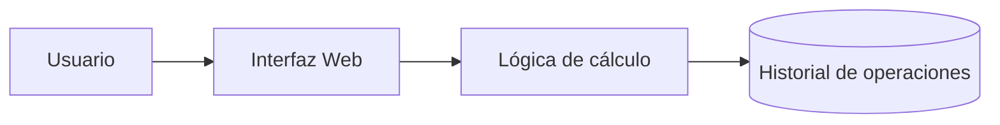

# Laboratorio README

 
Proyecto de práctica para aprender Markdown avanzado en GitHub.
 
## Descripción
 
Este repositorio documenta paso a paso mi aprendizaje de Markdown:
tablas, listas de tareas, badges y diagramas.


## Estado de funcionalidades

| Función  | Estado      |
|----------|-------------|
| Login    | Listo       |
| Reportes | En progreso |

## Pendientes
 
- [x] Diseño de la base de datos
- [ ] Pruebas unitarias

## Arquitectura


# Calculadora Web


Aplicación web sencilla para realizar operaciones matemáticas básicas (suma, resta, multiplicación y división) desde el navegador.

## Descripción

Este proyecto es una calculadora web que permite realizar operaciones matemáticas básicas (suma, resta, multiplicación y división) de forma rápida y sencilla desde el navegador.

## Tabla de contenidos

- [Descripción](#descripción)
- [Instalación](#instalación)
- [Uso](#uso)
- [Estado de funcionalidades](#estado-de-funcionalidades)
- [Arquitectura](#arquitectura)
- [Contribuidores](#contribuidores)

## Instalación

```bash
git clone https://github.com/juniorcm912-tech/laboratorio-readme.git
cd laboratorio-readme
npm install
```

## Uso

```bash
npm start
```

## Estado de funcionalidades

| Función         | Estado      |
|-----------------|-------------|
| Suma            | Listo       |
| Resta           | Listo       |
| Multiplicación  | Listo       |
| División        | En progreso |

## Pendientes

- [x] Diseño de la interfaz
- [x] Operaciones básicas (suma, resta, multiplicación)
- [ ] Validación de división entre cero
- [ ] Pruebas unitarias

## Arquitectura



## Contribuidores

- Junior Angel Condori Mamani ([@juniorcm912-tech](https://github.com/juniorcm912-tech))